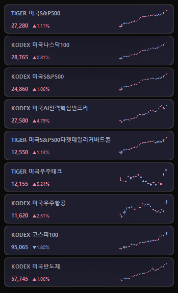
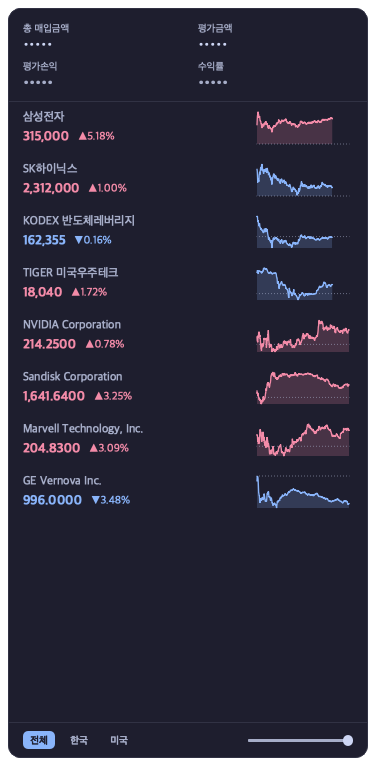

# 📈 한국 주식 위젯 (Pinstock)

실시간 한국 주식 현재가를 화면에 항상 띄워두는 미니 위젯 프로그램입니다.  
**Windows · macOS** 모두 지원하며 같은 `stocks.json` 데이터를 공유합니다.

<p align="center">
  <table>
    <tr>
      <td align="center"><b>Windows</b></td>
      <td align="center"><b>macOS</b></td>
    </tr>
    <tr>
      <td></td>
      <td></td>
    </tr>
  </table>
</p>

> **Windows** — 화면 우상단에 종목별 위젯이 세로 정렬되며 드래그로 모니터 어디든 자유롭게 배치할 수 있습니다.  
> **macOS** — 상단 메뉴바의 아이콘을 클릭하면 종목 리스트가 팝오버 패널로 펼쳐집니다.
> 두 OS 모두 장중에는 당일 분봉 sparkline 이, 장 외 시간·주말·공휴일에는 최근 30일 일봉 캔들 차트로 자동 폴백됩니다.

---

## 📥 다운로드 / 설치 (일반 사용자)

**Python 설치 없이 바로 실행 가능한 패키지 버전**은 GitHub Releases 에서 받을 수 있습니다.

👉 **[최신 릴리즈 다운로드](https://github.com/Hyuntae-Jeong/Pinstock/releases/latest)**

| OS | 파일 |
|---|---|
| **macOS** (Apple Silicon) | `Pinstock-mac-vX.Y.Z.zip` |
| **Windows** (64-bit) | `Pinstock-win-vX.Y.Z.zip` |

### macOS
1. `Pinstock-mac-vX.Y.Z.zip` 다운로드 → 더블클릭하면 자동으로 `Pinstock.app` 이 풀립니다.
2. `Pinstock.app` 을 **`응용 프로그램`** 폴더로 드래그.
3. **첫 실행 (한 번만 우회):**
   1. `Pinstock.app` 더블클릭 → *"Apple은 ... 악성 코드가 없음을 확인할 수 없습니다"* 차단 팝업 → **"완료"** 클릭해서 닫기.
   2. **시스템 설정 → 개인정보 보호 및 보안** 열기 → 아래로 스크롤.
   3. **"'Pinstock' 사용이 차단되었습니다…"** 메시지 옆 **"그래도 열기"** 버튼 클릭 → 암호/Touch ID 인증.
   4. 다시 `Pinstock.app` 더블클릭 → 새 팝업의 **"열기"** 클릭.
4. 메뉴바에 Pinstock 아이콘이 나타나면 끝. 이후엔 그냥 더블클릭으로 실행됩니다.

> 📝 macOS 15 (Sequoia) 이상부터는 Apple 이 *"우클릭 → 열기"* 단축 우회를 제거해서, **시스템 설정** 경로로만 첫 실행이 가능합니다. (이 앱은 무료 배포라 Apple Developer ID 코드 서명이 없습니다.)

### Windows
1. `Pinstock-win-vX.Y.Z.zip` 다운로드 → 우클릭 → 압축 풀기.
2. 풀린 `Pinstock` 폴더 전체를 원하는 위치(예: `C:\Program Files\Pinstock\` 또는 바탕화면)로 옮기고, 안의 `Pinstock.exe` 더블클릭.
3. **첫 실행**: "Windows 가 PC를 보호했습니다" 경고 → **"추가 정보" → "실행"** 클릭.
4. 시스템 트레이에 Pinstock 아이콘 + 화면 우상단에 위젯 표시.

> 자세한 안내·알려진 제약은 [최신 릴리즈 노트](https://github.com/Hyuntae-Jeong/Pinstock/releases/latest) 참고.

> 💡 **이미 Pinstock 을 쓰고 있나요?** 기존 버전에서 새 버전으로 업데이트하는 절차는 [UPGRADE.md](UPGRADE.md) 참고.

> 🔄 **앱 내 자동 업데이트 (v0.1.4+)** — 새 버전이 나오면 트레이 메뉴(Windows) 또는 메뉴바 팝오버(macOS) 의 **🔄 업데이트 확인** 에서 바로 다운로드·교체·재시작이 됩니다. 시작 시 자동으로 새 버전을 한 번 확인하며, 발견되면 OS 알림 토스트로 안내합니다.

---

## 🛠️ 소스에서 직접 실행 (개발자용)

코드를 수정하거나 직접 빌드하려는 경우.

### 1. 저장소 받기
```bash
git clone https://github.com/Hyuntae-Jeong/Pinstock.git
cd Pinstock
```

### 2. 가상환경 생성 (권장)
```bash
python -m venv .venv
# macOS / Linux
source .venv/bin/activate
# Windows (PowerShell)
.venv\Scripts\Activate.ps1
```

### 3. 라이브러리 설치
```bash
pip install -r requirements.txt
```

### 4. 실행
```bash
python -m pinstock
```

> 💡 **Windows 원클릭 실행**: 위 4단계까지 끝낸 뒤 [`Pinstock.vbs`](Pinstock.vbs) 를 더블클릭하면 PowerShell 을 열지 않아도 venv 의 `pythonw.exe -m pinstock` 으로 콘솔창 없이 백그라운드 실행됩니다. 우클릭 → "바탕화면에 바로 가기 만들기" 또는 "작업 표시줄에 고정" 으로 더 편하게 띄울 수 있습니다.

---

## 🖱️ 사용법

### Windows — 떠있는 위젯
| 동작 | 설명 |
|------|------|
| 종목 위젯 **좌클릭** | 평단가·수량·투자원금·평가금액·평가손익·수익률 확장 (5초 후 자동 축소) |
| **드래그** | 위젯을 원하는 위치로 이동 (이동 시 클릭으로 인식되지 않음) |
| **우클릭** | 수정 / 삭제 메뉴 |
| **시스템 트레이 좌클릭** | 모든 위젯 표시 / 숨김 빠른 토글 |
| **시스템 트레이 우클릭** | 종목 추가 / 관리 / Excel 내보내기·가져오기 / 위치 초기화 / **🔄 업데이트 확인** / 종료 |

- 위젯 가로폭은 가장 긴 종목명 기준으로 모든 위젯에 통일 적용됩니다.
- 현재가 옆에 등락률(▲/▼)이 함께 표시되며, 상승 시 빨강 · 하락 시 파랑으로 강조됩니다.

### macOS — 메뉴바 + 팝오버
| 동작 | 설명 |
|------|------|
| **메뉴바 Pinstock 아이콘 클릭** | 팝오버 패널 펼침 / 접기 |
| 팝오버의 종목 행 **좌클릭** | 평단가·수량·손익 펼침 |
| 팝오버의 종목 행 **우클릭** | 수정 / 삭제 메뉴 |
| 팝오버 **밖 클릭** | 자동으로 닫힘 (macOS native popover 패턴) |
| **➕ / 📋** 액션 버튼 | 종목 추가 / 일괄 관리 |
| **📤 / 📥** 액션 버튼 | Excel 내보내기 / 가져오기 |
| **🔄** 액션 버튼 | 업데이트 확인 (새 버전이 있으면 ● 뱃지) |
| **❌** 액션 버튼 | 종료 |

- 팝오버 상단에는 포트폴리오 요약(총 매입금액 / 평가금액 / 평가손익 / 수익률)이 항상 표시됩니다.

### 📋 종목 관리 창 (공통)

여러 종목을 한 화면에서 일괄 편집할 수 있는 다이얼로그입니다. (Windows 트레이 메뉴, macOS 팝오버 📋 버튼)

| 동작 | 설명 |
|------|------|
| **➕ 추가** | 새 종목 추가 (코드로 종목명 자동 조회, 중복 거부) |
| **✏ 수정** / 더블클릭 | 선택한 행의 평단가·수량 편집 |
| **🗑 삭제** | 선택한 행 삭제 (확인 절차 포함) |
| **행 드래그** | 종목 순서 변경 |
| **표시 토글 스위치** | 종목 위젯·팝오버에서 일시적으로 숨김 (`hidden: true` 저장) |
| **📊 평가손익 정렬** | 손익 내림차순 정렬 |
| **확인** | 변경 사항을 위젯과 `stocks.json` 에 반영 |
| **취소** | 모든 변경 사항 폐기 (원본 보존) |

---

## 🖥️ 멀티 모니터 (Windows)

- 위젯은 어느 모니터에서나 자유롭게 이동·배치할 수 있습니다.
- **위치 초기화**는 각 위젯이 *현재 속한 모니터*의 우상단에 정렬하므로, 멀티 모니터 환경에서 위젯이 엉뚱한 화면으로 이동하지 않습니다.
- 작업 표시줄 영역을 피하기 위해 `availableGeometry` 기준으로 좌표를 계산합니다.

(macOS 는 메뉴바 기반이라 모니터 위치 개념이 없습니다.)

---

## 📁 패키지 구조

```
pinstock/
├── __main__.py            python -m pinstock 진입점 (OS별 분기)
├── core/
│   ├── api.py             네이버 금융 API (시세·분봉·일봉)
│   ├── storage.py         OS별 설정 경로 / 자동 마이그레이션 / Excel I/O
│   └── updater.py         앱 내 자동 업데이트 (GitHub Releases + 헬퍼 스크립트)
├── ui_common/
│   └── update_dialog.py   업데이트 확인/다운로드 모달 (Win·Mac 공용)
├── ui_windows/            Windows: 떠있는 위젯
│   ├── floating_widget.py 개별 종목 위젯
│   ├── master_widget.py   포트폴리오 요약 마스터 위젯
│   ├── manage_dialog.py   종목 추가/관리 다이얼로그 (공통 사용)
│   ├── chart_widget.py    sparkline 미니 차트 (공통 사용)
│   ├── form_widgets.py    AutoSelect 입력 / ArrowSpinBox / ToggleSwitch
│   ├── theme.py           다크 테마 색상 + QSS
│   └── manager.py         Windows 전체 매니저
└── ui_macos/              macOS: 메뉴바 + 팝오버
    ├── menubar.py         메뉴바 Pinstock 아이콘 + 토글 트리거
    ├── popover.py         팝오버 패널 (요약 + 종목 리스트 + 액션 바)
    └── manager.py         macOS 매니저 + 종목별 폴링 워커
```

---

## 💾 설정 파일 위치

종료 시 위치·표시 상태가 자동 저장되며, 첫 실행 시 옛 버전(stocks.json 이 저장소 옆에 있던 시절)의 파일을 자동으로 새 위치로 이전합니다.

| OS | 경로 |
|---|---|
| **Windows** | `%APPDATA%\Pinstock\stocks.json` |
| **macOS** | `~/Library/Application Support/Pinstock/stocks.json` |
| **Linux** (시도해 본 적 없음) | `~/.config/Pinstock/stocks.json` |

JSON 스키마는 두 OS 가 동일합니다. 파일을 그대로 복사해 옮기면 종목 데이터가 그대로 인식됩니다 (Mac↔Win 간 위젯 위치 정보는 무시됨).

---

## 📌 종목 코드 예시

| 종목명 | 코드 |
|--------|------|
| 삼성전자 | 005930 |
| SK하이닉스 | 000660 |
| NAVER | 035420 |
| 카카오 | 035720 |
| LG에너지솔루션 | 373220 |
| 현대차 | 005380 |
| 셀트리온 | 068270 |
| 삼성바이오로직스 | 207940 |
| POSCO홀딩스 | 005490 |
| 기아 | 000270 |

> 코스닥 종목도 동일하게 6자리 코드로 입력하면 됩니다. ETF 등 영문 포함 코드도 지원합니다.

---

## ⚠️ 주의사항

- **시세 갱신 주기**: 현재가는 **5초**, sparkline 차트는 **60초** 마다 자동 갱신 (네이버 금융 API 사용)
- **장 마감 후**: 당일 종가가 표시됩니다 (sparkline 은 자동으로 최근 30일 일봉 캔들로 폴백)
- **인터넷 연결** 필요

---

## 📦 직접 빌드하기 (개발자용)

[`pinstock.spec`](pinstock.spec) 한 파일에 macOS / Windows 빌드 설정이 통합돼 있어, 같은 명령으로 양쪽 OS 빌드가 가능합니다.

### 사전 준비
```bash
pip install pyinstaller
```

### 아이콘 (변경됐을 때만)
원본 [`pinstock_icon.svg`](pinstock_icon.svg) 로부터 `assets/Pinstock.icns` (macOS) · `assets/Pinstock.ico` (Windows) 를 재생성합니다.
```bash
python scripts/build_icon.py
```

### 빌드
```bash
pyinstaller pinstock.spec --noconfirm
```
- **macOS** → `dist/Pinstock.app` (메뉴바 전용 — `LSUIElement=True` 로 Dock 미노출)
- **Windows** → `dist/Pinstock/` 폴더 (`Pinstock.exe` + Qt DLL 들)

### 배포용 zip 압축
```bash
# macOS — ditto 가 .app 의 확장속성·서명을 보존
ditto -c -k --sequesterRsrc --keepParent dist/Pinstock.app dist/Pinstock-macos.zip

# Windows (PowerShell)
Compress-Archive -Path dist\Pinstock -DestinationPath dist\Pinstock-windows.zip
```

### 릴리즈 업로드
```bash
gh release create v0.X.Y \
  dist/Pinstock-macos.zip \
  dist/Pinstock-windows.zip \
  --draft \
  --title "v0.X.Y — ..." \
  --notes-file RELEASE_NOTES.md
```
Draft 로 만들어 GitHub 웹에서 검토 후 **Publish release** 클릭.

> 🔒 **코드 서명**: macOS·Windows 둘 다 서명을 하지 않으므로 사용자가 첫 실행 시 보안 경고를 한 번 우회해야 합니다. 위 "[다운로드 / 설치](#-다운로드--설치-일반-사용자)" 섹션의 안내 참고.

---

## 📜 License

MIT License — 자유롭게 사용·수정·재배포할 수 있습니다.
자세한 내용은 [LICENSE](LICENSE) 참조.

## 💬 피드백 & 기여

이 프로젝트는 취미로 만든 사이드 프로젝트입니다.
**사용하시다가 불편한 점이나 "이런 기능이 있으면 좋겠다" 싶은 게 생기시면 망설이지 말고 알려주세요.** 작은 의견 하나가 다음 기능의 출발점이 됩니다. 직접 코드로 기여해주시는 것도 언제든 환영해요 🙌

- 🐛 **버그 발견**: [Bug Report](https://github.com/Hyuntae-Jeong/Pinstock/issues/new?template=bug_report.yml)
- 💡 **기능 제안**: [Feature Request](https://github.com/Hyuntae-Jeong/Pinstock/issues/new?template=feature_request.yml)
- 🔧 **직접 기여**: Fork → branch → PR — 자세한 절차는 [CONTRIBUTING.md](CONTRIBUTING.md) 를 참고해주세요. 처음 기여하시는 분은 [`good first issue`](https://github.com/Hyuntae-Jeong/Pinstock/labels/good%20first%20issue) 라벨이 붙은 이슈부터 살펴보시면 좋습니다.
